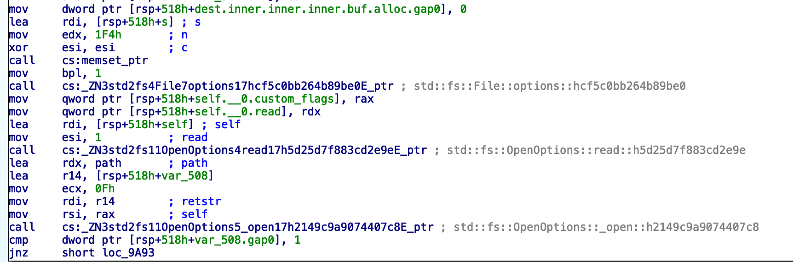

# [BreizhCTF - 2022]  Marteau rouillé, néanmoins plutôt rapide

By C0000005 with the help of LNK0

    Description:
    A cause de son stagiaire Julien, la DSI s'est encore pris un ransomware !
    (C'est la troisième fois à cause de lui)
    Ce fichier était très important, mais est maintenant inutilisable..
    Si seulement quelqu'un arrivait à le déchiffrer !

    Auteur: iHuggsy

    Format : BZHCTF{}

    File : target_release_rustyHammer
           important.enc

I did not finish this challenge in the CTF Time, but it was too interesting, to act like nothing captured my eyes during the CTF.(And also at this time, i did not have a VM). It was my first time reversing some Rust. So, please be gentle onii chann UwU ! 

We must be REALLY carefull, i've already encrypted my whole machine in RSA-2048 during a CTF cause i was too sleepy and did not read the BIG warning. 

## Reconnaissance 

We got 2 files, one seems to be the ransomware, and the other is the important file that we most recover in order to get our precious flag.


Let's first, look a our important file. It looks like this :
`?{??Ɠ?"^#??????^???ֳ??~9??Dz??⏎ `

Well okay not helping. I did this in case we can do some plain text attack. Since we know the flag format. But it's was useless.


Let's now look at the ransomware, i'm already scared cause i read Rust in the name, and even if Rust is a realy beautifull language, it's not fun to reverse, not fun at all.

Let's start, usual stuff, lets go for a file.

`target_release_rustyHammer: ELF 64-bit LSB pie executable, x86-64, version 1 (SYSV), dynamically linked, interpreter /lib64/ld-linux-x86-64.so.2, BuildID[sha1]=9755aa76eb54f28c0bb6c9db4685d603a6f46955, for GNU/Linux 4.4.0, with debug_info, not stripped`

Well we are lucky, there is debug_info and binarry is not stripped. So let's go for IDA. In the first time. 

What we must find in the binarry :
    
* Method of encryption
* The algorithm
* The key 
* Where does it looks for file


## Anlysing

Once loaded in IDA, we got the "main" function. 


Let's decode what we see. We are at the start, we can see the `argc` and `argv` been moved around. 
Then we can see that something called `rustyHammer4main' is loadedd. (LEA = Load Effective Addrress). I'm curious, let's go directly here. 

And we got the true main function. She looks like this:


And it's more awfull than i would think, name of the function looks like some deep old elfic language. BUT, IDA recognize the name of the function and give it the true name of it.

Below, we can see the start, and the declaration of some variable. We can also see, pointer to a Unix Socket, a buffer for the file path, the time at this instant, and a file descriptor instance being created. 


```rust
Unix::net::datagram // a sokcet 
std::fs::File // File descriptor
std::path::PathBuf // path to a file
std::time::Instant // time at this instant
std::fs::OpenOption // file descriptor option
```


Now we can go to our beloved opcodes, and find what we want. 


On the image, we can see that the time at this instant is called. It's the first call. Then a strange debug function. I tried to google it but nothing show off.

Then, the `print()` function is loaded and called. I can't determine what is printed, i guess it's somewhere in the data segement but no clue. In a debbuger i guess we can see what on the stack or heap. After, the `thread::sleep` function is loaded and called. 

Latter i will launch a virutal machine to execute the code and look at what will be loaded on the heapd and stack.

After this, there is a a repetition of sleep and print call. 

With what is added to the thing printed, i think something like a decreasing counter is printed. Going from 9 to 0.  


### File::Option::open 

Opening a file in Rust looks like, this : 

```rust
use std::fs::File;

let mut file = File::options()
    .read(true)
    .open(true)

// Stackoverflow
```
And at the end of the instruction block we can see the different call like `read `and `open`. We are on the good way. But we still don't know what is encrypted, a directory or a path.




## Finding the method of encryption in all this Rust

After the jump 
