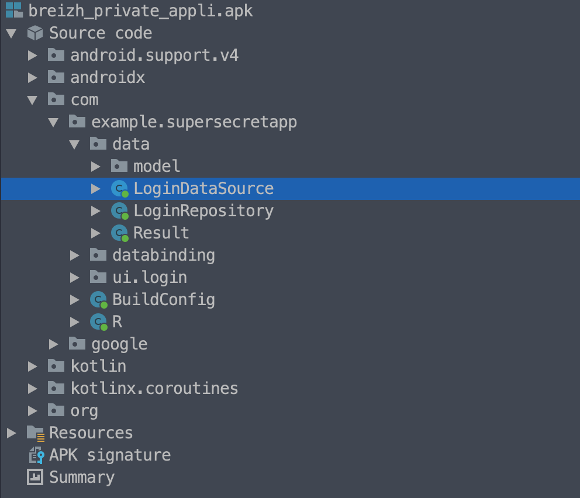

# [BreizhCTF - 2022 ] L'appli secrète du BreizhCTF

By C0000005

    Description:

    En arrivant à Rennes au BreizhCTF, vous avez trouvé un téléphone par terre et avez décidé de le garder avec vous. Vous vous rendez compte que sur ce téléphone, il y a une appli 'SuperSecretApp'.

    Malheureusement, pour accéder à son contenu, vous devez avoir la bonne combinaison du username et du password.

    Vous avez donc décidé de reverse l'application pour trouvez cela!

    Auteur: Worty

    Format : BZHCTF{username-password}

    File: breizh_private_appli.apk

## Reconnaissance

The given file is an application. So we can open it directly with jadx-gui (It was fun trying to install this). And start to analyze the app.

`$ C0000005@linux ~> jadx-gui breizh_private_appli.apk`


## Analyse

We got the decompiled app, so we got the code. By knowlegde i know that it will be stored somewhere in the com folder. It was, example.supersecretapp folder contain the code !!




We find the code used for validating the password and the Username, it's "kalucheAdmin:))", it's seems that we are on the good way !

```kotlin
package com.example.supersecretapp.data;

import com.example.supersecretapp.data.Result;
import com.example.supersecretapp.data.model.LoggedInUser;
import java.io.IOException;
import java.util.UUID;

/* loaded from: classes7.dex */
public class LoginDataSource {
    public boolean verifiedPassword(String pwd) {
        if (((char) (pwd.charAt(0) ^ "!".charAt(0))) != "@".charAt(0) || (pwd.charAt(1) ^ "m".charAt(0)) + 36 != 120 || ((char) (pwd.charAt(0) ^ pwd.charAt(2))) != "[".charAt(0) || pwd.charAt(3) != "V".charAt(0)) {
            return false;
        }
        if ((pwd.charAt(pwd.length() % 4) ^ pwd.charAt(4)) + 98 != "e".charAt(0) || ((char) (pwd.charAt(5) + 7)) != "T".charAt(0) || ((char) ((pwd.charAt(6) & 255) ^ 16)) != "h".charAt(0)) {
            return false;
        }
        if (pwd.charAt(7) == ((char) (pwd.charAt(5) ^ pwd.charAt(2)))) {
            return true;
        }
        return false;
    }

    public Result<LoggedInUser> login(String username, String password) {
        if (username.length() != 15 || password.length() != 8) {
            return new Result.Error(new IOException("Error logging in"));
        }
        if (!username.equals("kalucheAdmin:))")) {
            return new Result.Error(new IOException("Error logging in"));
        }
        if (!verifiedPassword(password)) {
            return new Result.Error(new IOException("Error logging in"));
        }
        LoggedInUser flagUser = new LoggedInUser(UUID.randomUUID().toString(), "Well done!");
        return new Result.Success(flagUser);
    }

    public void logout() {
    }
}
```

So we have the code bawse we need to use. 


## Solving the ASCII equation.

The function who valid the password is composed of 3 if().
We know that the password is equals to 8 character. So there is 1,7x10^(19) solutions.(Yes i've tried bruteforcing in the first place).

Fast i've tried to go on developping a solver, and chosed C++. Cause it was 4am in the morning. why not ?

The code is simply composed, for each char we must find, i wrote a small function returning a char that will comply with where the char is needed.


```cpp
//  Writed with the love of C0000005
//  BreizhCTF - 2022
//  Solver for L'appli secrète du breizhCTF

#include <random> // Yes i tried bruteforce
#include <stdio.h>
#include <stdlib.h>

char firstChar(){ // passwd[0]
    char solution = 0;
    for (int i = 0; i < 255; i++) {
        if ((i ^'!') == '@' ) {
            solution = i;
            break;
        }
    }
    return solution;
}
char secondChar(){ //passw[1]
    
    char solution = 0;
    for (int i = 0; i < 255; i++) {
        if ((i ^ 'm') + 36 == 120) {
            solution = i;

            break;
        }
    }
    return solution;
}
char thridChar(){ // passw[2]
    
    char solution = 0;
    
    for (int i = 0; i < 255; i++) {
        if (( 'a' ^ i) == '[') {
            solution = i;
            return solution;
        }
    }
    return solution;
}

char fourthChar(){ // passwd[3]
    
    char solution = 0;
    for (int i = 0; i < 255; i++) {
        if (i == 'V') {
            solution = i;
            break;
        }
    }
    
    return solution;
}

char fifthChar(){ //passwd[4]

    char solution = 0;  
    for (int i =0; i <255; i++) {
        if ((('a' ^i ) + 98 ) == 'e') {
            solution = i;
        }
    }
    return solution;
}
char sixChar(){ //passwd[5]
    
    char solution = 0;
    for (int i = 0; i < 255; i++) {
        if (((char)(i) + 7) == 'T') {
            solution = i;
        }
    }
    return solution;
}
char sevenChar(){ //passwd[6]
    char solution = 0;
    for (int i = 0; i < 255; i++) {
        if (((i & 255) ^16) == 'h') {
            solution = i;
            break;
        }
    }
    return solution;
}

char heightChar(char five, char two ){ //passwd [7]
    char solution = 0;
    
    for (int i = 0; i < 255; i++) {
        if( i == (five ^two)){
            solution = i;
            break;
        }
    }
    return solution;
}

int main(){
    
    const char * login = "kalucheAdmin:))";
    const char * BZH = "BZHCTF";
    const char * BZHBrackets = "{}";
    size_t flagSize = strlen(BZH) + strlen(BZHBrackets) + 8 + strlen(login);
    char * solution = (char*) malloc(flagSize);
    
    solution[0] = firstChar();
    solution[1] = secondChar();
    solution[2] = thridChar();
    solution[3] = fourthChar();
    solution[4] = fifthChar();
    solution[5] = sixChar();
    solution[6] = sevenChar();
    solution[7] = heightChar(solution[5], solution[2]);
    
    printf("[+] Finding password\n");
    printf("[+] login is %s \n", login);
    printf("[+] Concatening with Flag Pattern\n");
    printf("[+] Flag is %s%c%s-%s%c\n   ",BZH,BZHBrackets[0],login,solution,BZHBrackets[1]);
    
    free(solution);
    return 0;
}

```

Now we just have to commpile and execute the code, et voilà ! 

```s
[+] Finding password
[+] login is kalucheAdmin:))
[+] Concatening with Flag Pattern
[+] Flag is BZHCTF{kalucheAdmin:))-a9:VbMxw}
```


##

So here is the flag : BZHCTF{kalucheAdmin:))-a9:VbMxw}
It was a cool challenge, it's always cool to have one Android reverse challenge to rest during this awesome night.


