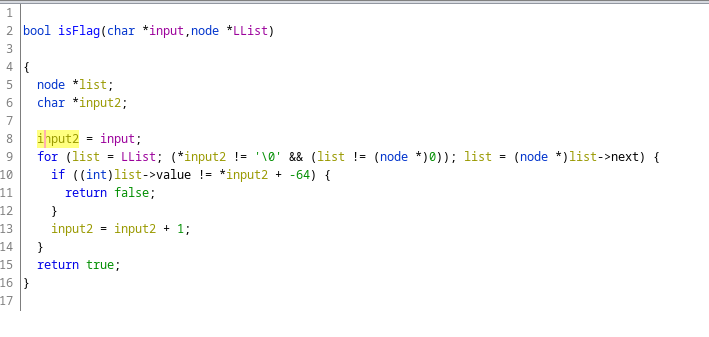

# [ PWNME ] crackme - LinkedList

By C0000005


    Crackme
    easy

    Find the password

    flag format: PWNME{flag}

    Author: Bryton#2690


`Crack-me type : main.exe: PE32+ executable (console) x86-64, for MS Windows`


## Main Function 

Eazy boy, let's load this exe into the god blessed Interactive Disassembler (Ghidra is so much better).


Two important function seems to be called. The first one is `initFlag()`, and `isFlag()` who takes our input stored in `Buffer` and the return of `initFLag`.

`FILE *v3` is stdin.

### 1 - initFlag()

Here is the pseudo code. 


Well this looks like familiar, a linked list. Why can i say this ? Well this year at school i have played with this, and this remind me of how i did it....

So the linked list seems to be initialized with a value. And then we insert ?at the end? a new value. 


### 1.1 - node_insert()

Let's deeeeep dive in this function. The function is cleaned for u <3 cause dam it was shitty


Firstly we iterate over the linked list to find the end of it. Its the for loop, that we can translate as `while(last->next != 0)`

Then a malloc for a new node inserted at the end. 

But the more interesting part is at the 15 line. We subtract 32 from the value passed as the second parameter to the function. 

So let's extract all of the values and add -32 to them. 
This give us the following values : 
```c
//c ftw
int tbl[] = {76,17,78,75,19,68,63,76,17,83,84,63,17,78,63,77,19,77,16,82,89};
size_t size =  sizeof(tbl)/sizeof(tbl[0]);

for(int i = 0; i < size; i++)
{
    tbl[i] -= 32 ;
}

// output is 44,-15,46,43,-13,36,31,44,-15,51,52,31,-15,46,31,45,-13,45,-16,50,57

```


So since we know the content of what is returned by this function let's go to the Flag fun.


## 2 - isFlaf() -- ftw

The function is cleaned for u <3



So the function take two parameters, our imput and the address of Linked List. Then we iterate over the linked list, with two conditions, the end of our input ( the apparition of a C-string end : `\0`) and the existence of a next node.
During the iteration a `if()` verify if that our input to which we subtract 64 is equal to the value n of the linked list.

The solution is a simple, add 64 to the value from the linked list.

```cpp
for (int i = 0; i < size; i++)
{
    tbl[i] += 64;
        
}
```

## 3 - FLAAAAAAAAAAAAAAAAAAAAAAAAAAAAAAAAAAAAAAAAG


Let's put everything in form, and here is our solver (commusim is good )


```cpp
#include <iostream>

int main(){

    int tbl[] = {76,17,78,75,19,68,63,76,17,83,84,63,17,78,63,77,19,77,16,82,89};
    size_t size =  sizeof(tbl)/sizeof(tbl[0]);

    for(int i = 0; i < size; i++)
    {
        tbl[i] -= 32 ;
    }

    std::cout << "PWNME{";
    for (int i = 0; i < size; i++)
    {
        std::cout << (char)(tbl[i] + 64);
        
    }
    
    std::cout << "}" << std::endl;

    return 0;
}

```

And the our flag is printed:
```
PWNME{l1nk3d_l1st_1n_m3m0ry}
```
