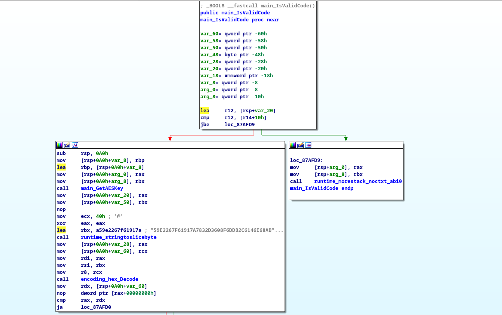

# [ PWNME ] Attack Equation Solving


By C0000005

    Description :
    
    I love virGIN tonic

    Vous avez accès au code compilé du site web

    Le flag est sous le format suivant: PWNME{flag}

    ps: afin de valider le code sur le formulaire web il ne faut pas mettre PWNME{}.

    Author: Bryton#2690

    File : attack_solving.rar
    
    attack_solving/
    ├── attack_equation_solving
    └── views
        ├── app
        │   ├── cat.jpg
        │   └── login.css
        ├── lib
        └── login.tmpl


`attack_equation_solving type: ELF 64-bit LSB executable, x86-64, version 1 (SYSV), statically linked, Go BuildID=qTNzwtym0NDcqIernhQq/9J2RwY_-MPdkEdw4jVzM/kDstZWXuauyn41tCV0vw/SmJI0_517_y8Dg9qdghH, not stripped`

## 1 - Analysis


Firstly, it's a Golang bin who provides a Web server through GIN. Gin is a HTTP web framework written in Go (Golang). It features a Martini-like API with much better performance -- up to 40 times faster [Doc Here](https://github.com/gin-gonic/gin)) 

Secondly, if we lauch the binary we can see that this bin provides two endpoints. 

- /
- /verify


```

[GIN-debug] [WARNING] Creating an Engine instance with the Logger and Recovery middleware already attached.

[GIN-debug] [WARNING] Running in "debug" mode. Switch to "release" mode in production.
 - using env:	export GIN_MODE=release
 - using code:	gin.SetMode(gin.ReleaseMode)

[GIN-debug] Loaded HTML Templates (2):
	-
	- login.tmpl

[GIN-debug] GET    /app/*filepath            --> github.com/gin-gonic/gin.(*RouterGroup).createStaticHandler.func1 (3 handlers)
[GIN-debug] HEAD   /app/*filepath            --> github.com/gin-gonic/gin.(*RouterGroup).createStaticHandler.func1 (3 handlers)
[GIN-debug] GET    /lib/*filepath            --> github.com/gin-gonic/gin.(*RouterGroup).createStaticHandler.func1 (3 handlers)
[GIN-debug] HEAD   /lib/*filepath            --> github.com/gin-gonic/gin.(*RouterGroup).createStaticHandler.func1 (3 handlers)
[GIN-debug] GET    /                         --> main.LoginPage (3 handlers)
[GIN-debug] POST   /verify                   --> main.VerifyCode (3 handlers)
[GIN-debug] [WARNING] You trusted all proxies, this is NOT safe. We recommend you to set a value.
Please check https://pkg.go.dev/github.com/gin-gonic/gin#readme-don-t-trust-all-proxies for details.
[GIN-debug] Listening and serving HTTP on :8000
```

Thirdly, if we look at the web page, we need to find a password to unlock the chest.


## 2 - main()?

Let's load the bin in IDA in order to understand what's happening inside. IDA give us a bunch of main_related function. 


First things that trigger me is the function `main_IsValidCode`. And the second, there is crytpo inside, this trigger PTSD from FCSC of course. 

Here is the decompiled `main_IsValidCode`, it's useless to generate pseudocode, it's Go so there will be nonsens code useless and boring.



Firstly, the `main_GetAESKey` function is called who return then an md5 string. 


Secondly we load an Hex string which is decoded with the function `encoding_hex_decode .

```asm
lea     rbx, a59e2267f61917a ; "59E2267F61917A7832D3608F6DDB2C6146E68AB"
...
call    encoding_hex_Decode
```

Thirdly, the program dercypt the decoded hex string with the function `github_com_forgoer_openssl_AesECBDecrypt`. 

We could try to add a breakpoint at the return of this this function to view the decrypted string.


## 3 - Finding address cause i'm stupid

So first lets find the adress of our function with `nm` fun. 
```sh
 ╭─C0000005@Garruda in ~/Documents/Rev/attack_solving took 47ms
 ╰─λ nm attack_equation_solving | grep "main"
00000000005e0c80 T crypto/x509.domainToReverseLabels
00000000005e13a0 T crypto/x509.matchDomainConstraint
0000000000a25dc0 R go.itab.vendor/golang.org/x/net/http/httpproxy.domainMatch,vendor/golang.org/x/net/http/httpproxy.matcher
000000000087b000 T main.BasePath
000000000087ad80 T main.GetAESKey
0000000000cdf3e0 D main..inittask
000000000087ae60 T main.IsValidCode
000000000087ac80 T main.KeyToMd5
000000000087b080 T main.LoginPage
000000000087b4a0 T main.main
000000000087b140 T main.VerifyCode
```


The adress we want to disassemble is 0x87ae60.


We find the adress of the function, lets dissasemble 0x698260.


Now we have the address of the retn instruction. Let's go to gdb.

## 4 - Gros DéBile

So let's load the bin inside GDB. And add a breakpoint at *0x6982ee. And let's run the bin. 
.  

Now we need to submit a random password on the endpoint. And look at our registers. 


And what can we see ? The flag on the RAX register. 
`0xc0004a2220:	"pr0_cr4ck3r_g000"`

So the flag is PWNME{pr0_cr4ck3r_g000}.


