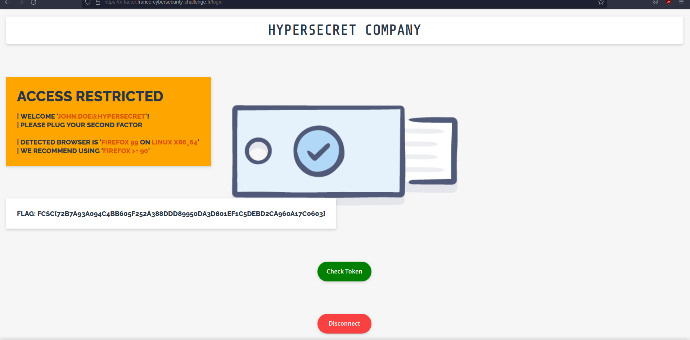
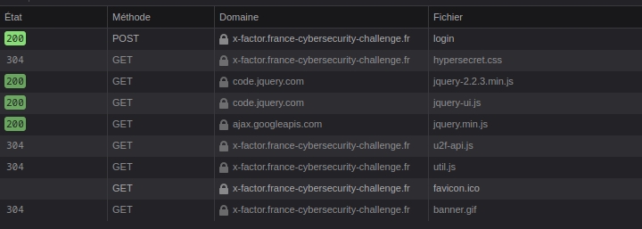
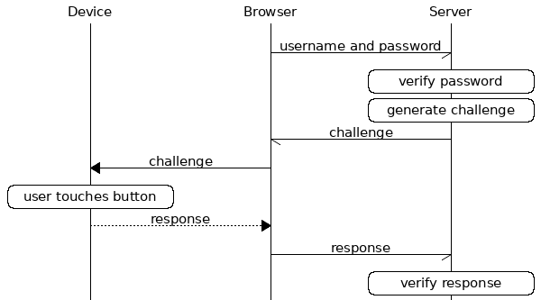

# [FCSC - 2022] X-Factor 2 / 2

    Catégorie : Hardware Web

    Difficulté : Hardcore

    Description : 

    Un commanditaire vous a demandé de récupérer les données ultra secrètes d'une entreprise concurrente. Vous avez tenté plusieurs approches de recherche de vulnérabilités sur les serveurs exposés qui se sont malheureusement révélées infructueuses : les serveurs de l'entreprise ont l'air solides et bien protégés. L'intrusion physique dans les locaux paraît complexe vu tous les badges d'accès nécessaires et les caméras de surveillance.

    Une possibilité réside dans l'accès distant qu'ont les employés de l'entreprise à leur portail de travail collaboratif : l'accès à celui-ci se fait via deux facteurs d'authentification, un mot de passe ainsi qu'un token physique à brancher sur l'USB avec reconnaissance biométrique d'empreinte digitale. Même en cas de vol de celui-ci, il sera difficile de l'exploiter. Installer un malware evil maid sur un laptop de l'entreprise n'est pas une option : ceux-ci sont très bien protégés avec du secure boot via TPM, et du chiffrement de disque faisant usage du token.

    Mais tout espoir n'est pas perdu ! Vous profitez du voyage en train d'un des employés et de sa fugace absence au wagon bar pour brancher discrètement un sniffer USB miniaturisé sur le laptop. Vous glissez aussi une caméra cachée au dessus de son siège qui n'a pu capturer que quelques secondes. Vous récupérez la caméra et le sniffer furtivement après sa séance de travail : saurez-vous exploiter les données collectées pour mener à bien votre contrat ?

    Pour obtenir le flag de X-Factor 1/2, vous devez vous logguer avec login et mot de passe. Puis avec le deuxième facteur d'authentification pour obtenir le flag pour X-Factor 2/2.

    Fichiers : - capture_USB.pcappng
               - login_password.mkv


## 1 - Reconaissance 




Une fois sur le site web, deux choses nous sont proposées, Check Token et Disconnect. On voit à gauche, qu'il est demandé de brancher un deuxième facteur d'authentification. A compté de ce moment, on sait que la caputre de l'échange USB devrait contenir des données qui nous permettront de vérifier le token. 

Il nous faut donc déterminter le standard qui est utilisé, un petit tour dans l'onglet network des outils de developpeurs, et hop c'est trouvé. 
Le fichier  ```u2f-api.js``` .



C'est le standard U2F, on a de la chance il est plutôt bien documenté donc pas besoin de reverse le bousin. Deuxième coup de chance, j'ai déjà joué avec cette norme dans un CTF orienté blockchain/cryptomoula.

Deuxième fichier important, il s'agit du fichier ```login.js```, dedans il y a tout un tas de trucs inutiles, MAIS il y a les fonctions relativent au boutton ```CheckToken```.


1. BeginAuth
2. FinishAuth


Donc après une rapide reconnaisance du site web, on sait quoi : 

C'est un challenge qui a pour but de faire une replay attack sur une authentification à double facteur. La norme utilisé est le ```universal 2nd factor``` . LIen : [U2F](https://developers.yubico.com/U2F/)


## 2 - Universal 2nd Factor comment ça fonctionne ?

Le diagramme suivant montre comment ce truc fonctionne.



Pour résumer, lorsque l'on va cliquer sur ```Check Token```, on va éxécuter la fonction ```beginAuth```. Cette fonction va aller se mélér avec l'API (```\beginAuth```) pour récupérer un challenge. 


Il est imortant de noter qu'il n'ya que 3 challenges différents :

    1. 9rlDOo98PIKIiubib97v4IDCJ1FBB2uRUhNgwH89wqw
    2. D5CxgaFPGIQu5fGYPEjo-YA9Dqd6y2PBoWP6p56TpFw
    3. L8tsCkDErRPzV9SAOlOj2JzFMXAOjmUs7JnimkH9_gI


Une fois que la fonction à récupérer le JSON avec le challenge, il part illico dans la fonction ```u2f.sign``` qui elle appelle la fonction ```finishAuthen``` qui elle va se mélér avec l'API (```\finishAuthen```), qui permet de valider l'auth. 


Avec l'ensemble des informations qu'on a récupérer on peut allez se taper avec le PCAP. 


## 3 - Analyse du PCAP

C'est ici que l'enfer commence, on va donc ouvrir le pcap dans WireShark. 