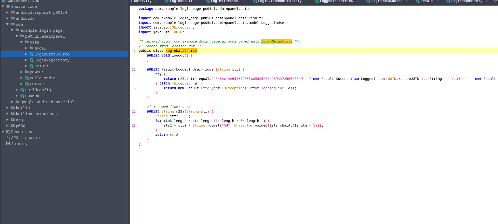

# [Midnight Flag]  Admin Pannel 

 
> Waiting description 
> File : Admin_Panel.apk

## 1 - Decompiling APK

As usual, you can unzip it, since an .apk is a collection of compressed files. But it's useless, we wil just open it using jadx-gui (jadx is a tool that allows to produce java classes from .apk or .dex files) 

## 2 - Analysing the code

We must find the mainActivity, since it's the default page loaded when you start an application, once we find it, we can start to look at the code and find the authentification process. 

By habit, we know that the code is located in the com file. We can see two interseting folder, one named p006ui, and an other called data. I guess that the folder with UI is the User Interface code, so let's focus on tha data folder. 

The first file seems, really interresting, a function named login, with a terner operator being used !! Well, we got it, our flag is here. 
