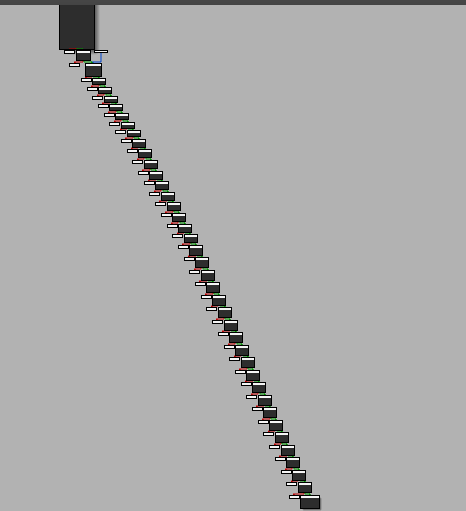

# BreizhCTF - Breton 


The binary is a classic cracke where we iterate over `argv[1]`

Cf, the start of the binary : 
```
if ( argc != 2 )
    revolte(argc, argv, envp);
  v3 = argv[1];
  if ( strlen(v3) != 39 )
    revolte(v3, argv, v4);
  v5 = argv[1];
  strcpy(dest, v5);

```

`Revolte()` is an exit function with a `print`, we cann se that the input must be 39 char.



## Leveraging SymExec & SAT Solver

Since it would be long to write the script with z3 to solv. We can use a SymExec engine such as Triton or Angr, i've decided to go with Angr since Triton needs a lot of code. Here is the solv script. We just give him the address we want to reach(Here a print)


```python

import claripy
import sys


project = angr.Project("./breton")
argv = claripy.BVS('argv',8*0x27) # Symbolize input with a BitVector 
ini_state = project.factory.entry_state(args=["./breton",argv])


ini_state.add_constraints(argv.get_byte(0) == 0x42) # Add constraint to the model 
ini_state.add_constraints(argv.get_byte(1) == 0x5A)


simulation = project.factory.simgr(ini_state)
simulation.explore(find=0x04015D8)


if len(simulation.found) > 0:
        for solution_state in simulation.found:
            print("[>>] {!r}".format(solution_state.solver.eval(argv,cast_to=bytes)))
else:
    print("[>>] no solution found :(")
```


Flag: [>>] b'BZHCTF{R3V3r5eR_l177le_ch3E5er_uhu-uhu}'

